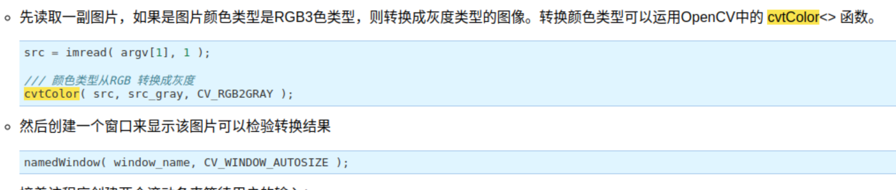
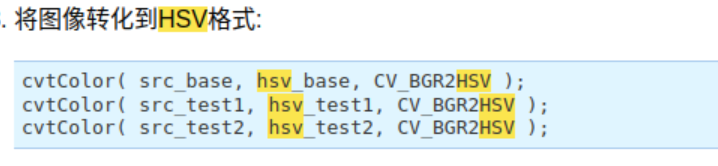
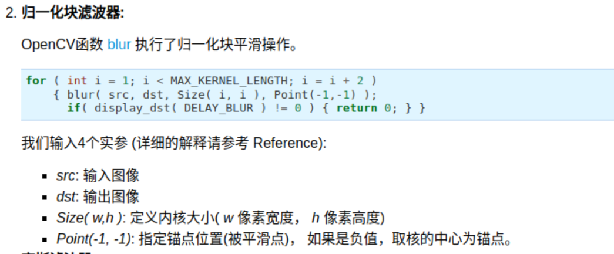
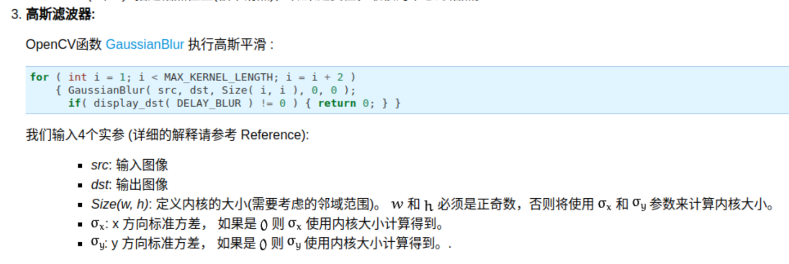
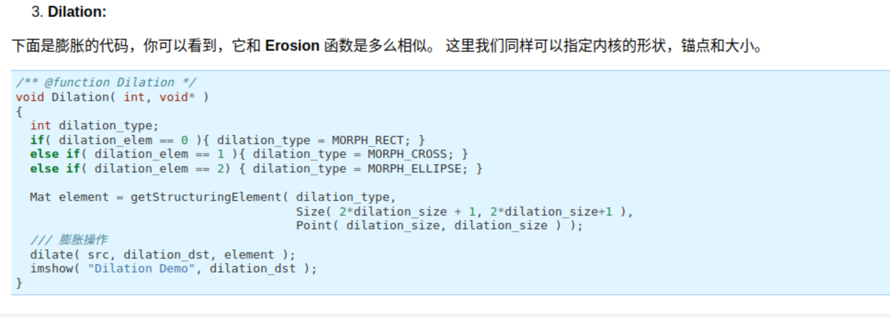
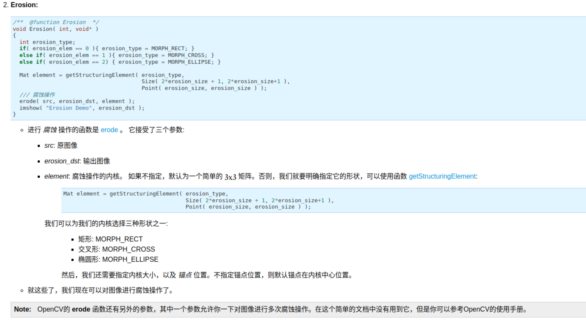
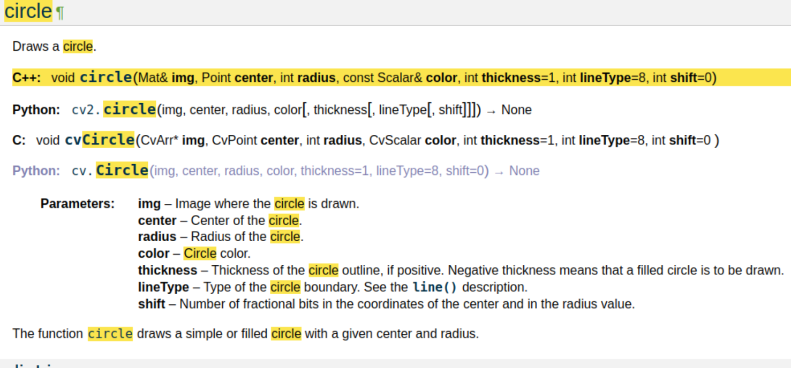
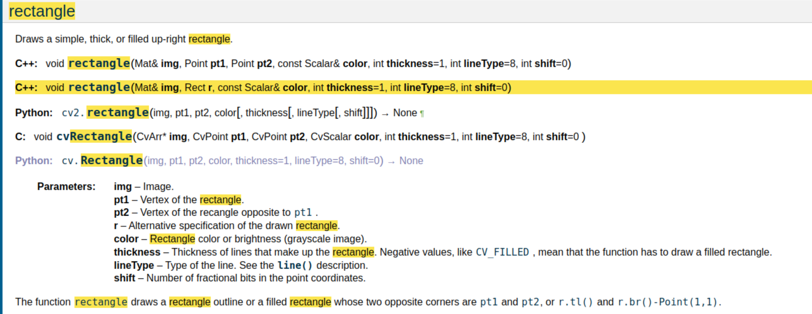
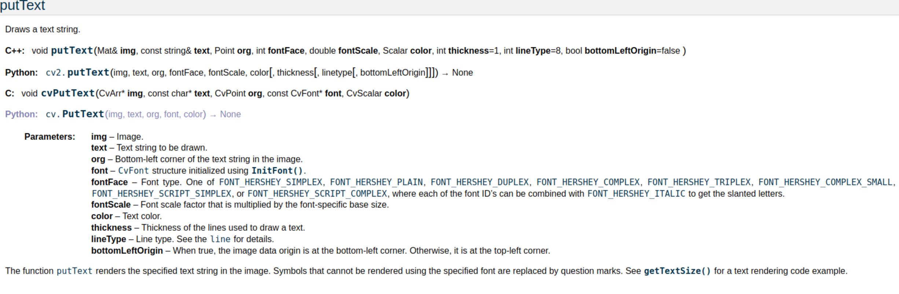
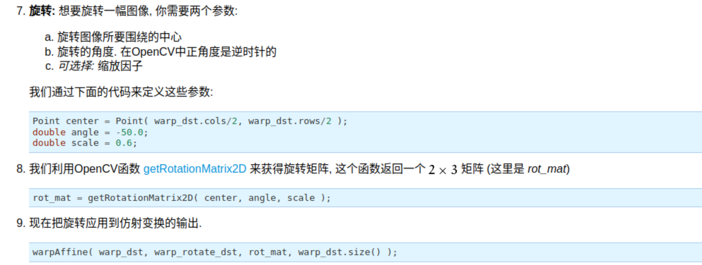

# Task02
## 使用 C++ 和 OpenCV 进行图像处理
### 一、配置 C++ 开发环境
安装了 VSCode 并安装了 CMake 和 C/C++ 插件。在终端输入`gcc --version`发现系统未安装gcc。输入`sudo apt install gcc`后得以安装。后使用`sudo apt install cmake`命令安装了 CMake。使用 VSCode 创建初始项目测试，并未发现任何问题。
### 二、安装 OpenCV 库
根据任务书的指引，无任何问题。
### 三、核心实现
#### 初识 OpenCVC
阅读了，对OpenCV中的功能、数据存储形式有了大致的了解。
#### 主程序开发
找到了一份非官方的,对任务书的中的每个功能进行检索，查阅相关的函数。
- 图像颜色空间转换（**备注：`cvtColor()`的第三个参数中的“CV”应改为"COLOR“，如"CV_BGRA2GRAY"应改为"COLOR_BGRA2GRAY"。这可能是因为 OpenCV 版本不同造成的问题**）
    - 转化为灰度图
    - 转化为 HSV 图片
- 应用各种滤波操作
  - 应用均值滤波
  - 应用高斯滤波
- 特征提取  
    对于区域和轮廓的处理，想到遍历图像中每个像素分别进行判断的方法。
    - 寻找红色区域
    ```C++
     //基于 HSV 颜色空间提取红色区域
    Mat imageRed = Mat::zeros(image.size(), imageHSV.type());  // 创建一个与原图相同尺寸的空图像
    for(int i = 0; i < image.rows; ++i){
        for(int j = 0; j < image.cols; ++j){
            // 提取当前像素的 HSV 值
            Vec3b hsvPixel = imageHSV.at<Vec3b>(i,j);
            int h = hsvPixel[0];
            int s = hsvPixel[1];
            int v = hsvPixel[2];
            if ((h <= 10 || (h >= 156 && h <= 180)) && s >= 43 && s <= 255 && v >= 46 && v <= 255) {
                imageRed.at<Vec3b>(i,j) = image.at<Vec3b>(i,j);  // 保留红色区域
            } else {
                imageRed.at<Vec3b>(i,j) = Vec3b(0, 0, 0);  // 将其他区域设为黑色
            }
        }
    ``` 
    - 找出轮廓并绘制
    ```C++
    //找出轮廓并绘制轮廓线
    Mat imageCountour=Mat::zeros(image.size(), image.type());
    for(int i=0;i<image.rows;++i){
        for(int j=0;j<image.cols;++j){
            if(imageRed.at<Vec3b>(i,j)==Vec3b(0,0,0) && imageRed.at<Vec3b>(i,j+1)!=Vec3b(0,0,0))
                imageCountour.at<Vec3b>(i,j)=Vec3b(0,0,0);//若上一个像素是黑的而下一个不是，那么上一个像素即为外轮廓的一部分
            else if(imageRed.at<Vec3b>(i,j)!=Vec3b(0,0,0) && imageRed.at<Vec3b>(i,j+1)==Vec3b(0,0,0))
                imageCountour.at<Vec3b>(i,j+1)=Vec3b(0,0,0);//若下一个像素是黑的而上一个不是，那么下一个像素即为外轮廓的一部分
            else imageCountour.at<Vec3b>(i,j)=Vec3b(255,255,255);
        }
    }
    ```
    后查阅 OpenCV 中有相应的函数能完成以上操作，于是将代码改为 main 中现在的样子。  
    - 寻找 bounding box 并绘制:
    - 计算轮廓的面积:
    - 提取高亮颜色区域并进行图形学处理
      - 灰度化
      - 二值化
      - 膨胀
      - 腐蚀
      - 对处理后的图像进行漫水处理  
- 图像绘制
  - 绘制任意圆形方形和文字
- 对图像进行处理
    - 图像旋转35度
    - 图像裁减为左上角 $\frac{1}{4}$ ：遍历图片左上角 $\frac{1}{4}$ 的每个像素点并将他们复制到新图像中。
    